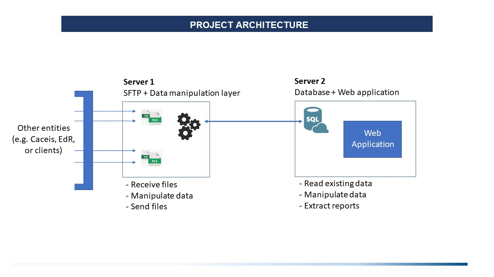
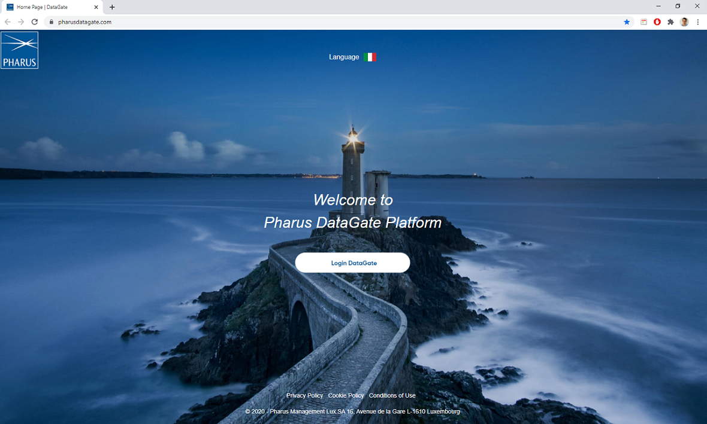
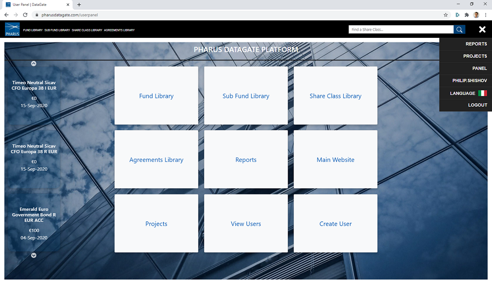
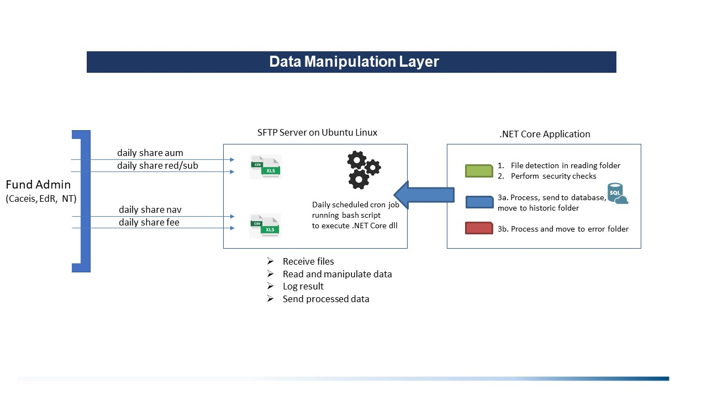

## Project Introduction

**"DataGate"** project is consisted of two parts: **DataGate Web Platform** and **DataGate Report Processor**

## DataGate Web Platform 

https://pharusdatagate.com  

A private web application for managing more than 250 funds.  
It is developed to be used by Pharus Management Lux S.A in order to  
centralize internal data and allow each user to be able to  
find relevant information in a fast way, saving time, reducing operational errors  
and automating some parts of the Risk and Legal department.

## General Info

The application can display NAV reports on chosen time period and  
detailed information about the UCITS and AIF handled by the management company such as: 
* General related entity view
* Sub entities
* Timeline changes
* Timeseries AuM charts
* All related documents
* All related agreements
* Fees related to agreements
 
 ## Registration
Registration is only possible through email invitation and confirmation.  
A guest account has been set-up for free use.  

Username: **datagate_guest**  
Password: **datagate_guest**  
 
 ## Technologies
* IDE - Visual Studio 2019, VS Code
* Framework - ASP.NET Core 3.1
* Version Control - Git, TortoiseGit, GitHub
* DevOps - Application Insights, Azure Pipelines
* Hosting and File Storage - GoDaddy WebWiz
* Project Management - Jira, Trello
* Code review, StyleCop

### Database 
* MSSQL Server, mylittleadmin
* Entity Framework Core 3.1, Scaffold, LINQ

### Backend
* C# .NET Core 3.1
* Design Pattern - DAO, DI, TAP, MVC, REST, Repository, SOLID
* SendGrid, AutoMapper, IStringLocalizer/IHtmlLocalizer, EPPlus, itext7

### Client-side
* RAZOR, JavaScript ES6, jQuery, Bootstrap
* JS/jQuery - DataTable, Chart, Chosen, Moment, Slick, SweetAlert, Browser-Update, Cookie
* Libman, Bundle, WebCompiler
* UI/UX design - Photoshop, HTML5 (SVG, Canvas), SCSS/CSS3

### Security
 * ASP.NET Core
 * X-CSRF
 * Cross-site Scripting (XSS)
 * Antiforgery
 * Overposting
 * HTML Sanitization
 * SQL Injection
 * SSL
 * ReCaptcha
 * Browser Update
 
   ## DataGate Report Processor
 
  [Report Processor - .NET Core application running on SFTP Server.   

The main function is automatic feeding of data into an internal database by the Fund Admin (Asset under management, Subscription, Redeption, Net asset value, Fee)

  
  ## History
**2020-10-30** Updated to ASP.NET Core 3.1.9
  
**2020-10-12** SFTP Data Manipulation Layer

**2020-09-02** Updated to ASP.NET Core 3.1.7

**2020-07-14** Updated to ASP.NET Core 3.1.6

**2020-06-22** Released DataGate v2.0

**2020-02-28** Released DataGate v1.0 with ASP.NET Core 2.1
  
